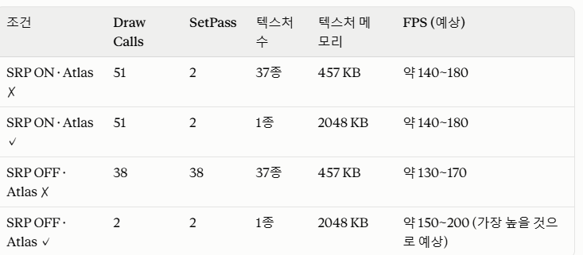
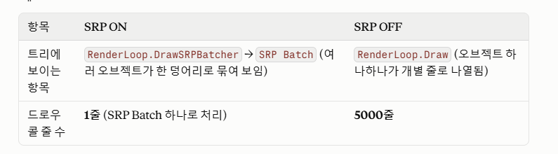
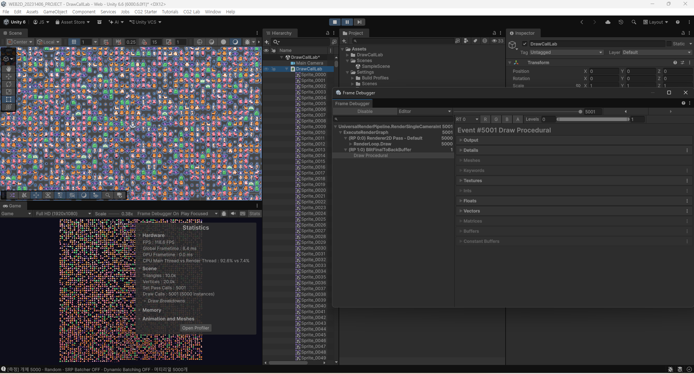

# WEB2D_20231406_PROJECT

Unity 2D 프로젝트입니다.

## 프로젝트 개요
- 2D 게임 프로젝트 개발 실습용 저장소
- Unity 엔진 기반으로 제작
- 게임 로직, 씬 구성, 오브젝트 제어 등을 학습 및 구현

## 개발 환경
- Unity
- C#
- GitHub

## 실행 방법
1. Unity Hub에서 이 프로젝트를 열기
2. 해당 씬을 로드
3. Play 버튼을 눌러 실행

## 저장소 정보
- GitHub: https://github.com/sonjeonghee12/WEB2D_20231406_PROJECT

## 참고
- 본 프로젝트는 교육/실습용으로 구성되었습니다.

3주차 간단문제 풀기

Q & A

• 오늘의 핵심 정리

• 오브젝트 수와 Draw Call 수는 항상 같은 값이 아니다.

• SRP Batcher는 Draw Call을 감소 x, CPU 렌더링 준비 비용을 줄이는 기
술이다.

• Sprite Atlas는 텍스처를 통합해 배칭 조건을 개선할 수 있지만, 메모리
증가와 같은 대가가 발생한다.

• SRP Batcher에 Sprite Atlas의 조합은 실제 성능 테스트를 통해 검증해
야 한다.